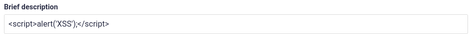
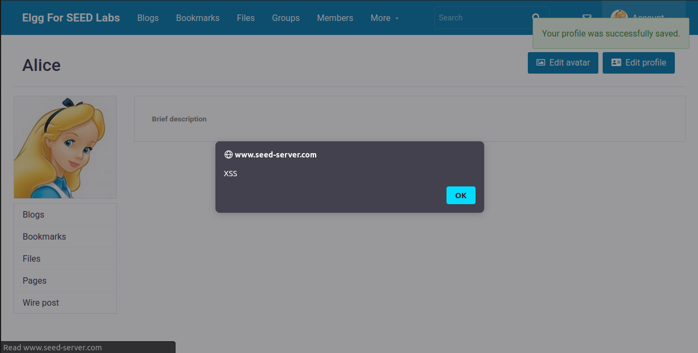
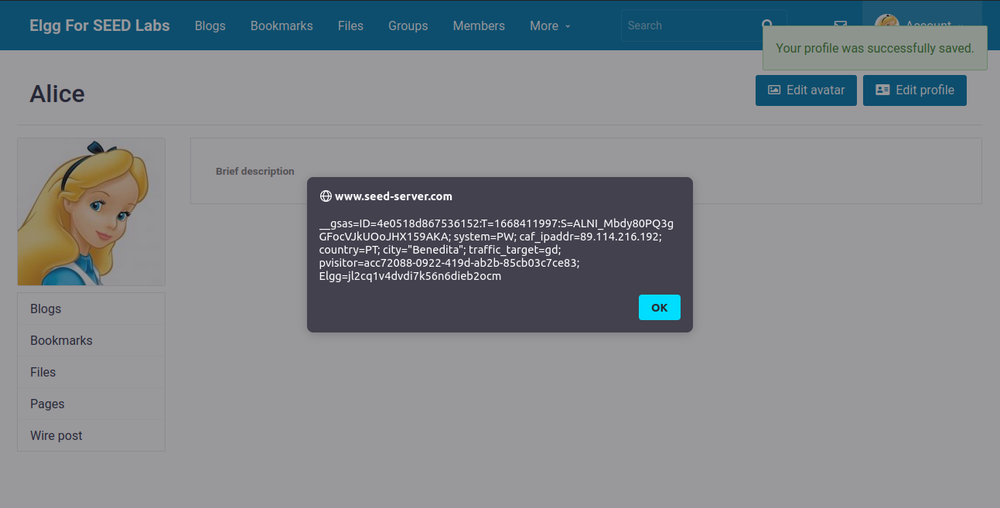
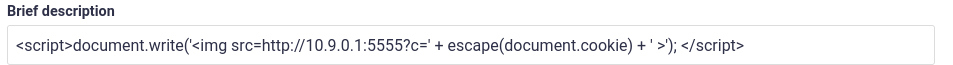
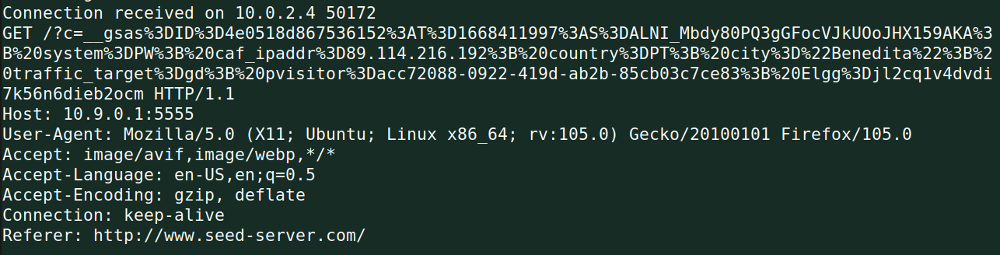

# Cross-Site Scripting (XSS) Attack Lab

## Task 1: Posting a Malicious Message to Display an Alert Window

After logging in as Alice, we enter the XSS payload to the brief description
field of the profile:



After saving and going back to the profile page, we get an alert:



This is an instance of Stored XSS, since the payload is stored in the user
profile and will be loaded everytime the profile page is visited.

## Task 2: Posting a Malicious Message to Display Cookies

For this task, we just replace the previous payload with the new one:

```html
<script>alert(document.cookie);</script>
```

And in the content of the alert we see that our cookies are being displayed:



## Task 3: Stealing Cookies from the Victim’s Machine

In this task, we are asked to, once again, get the victim's cookies, but this
time we need to send them to an attacker controlled machine. Firstly, we will
start a netcat server that will receive the leaked cookies:

```sh
$ nc -lknv 5555
Listening on 0.0.0.0 5555
```

Then, we store the given payload in the Brief Description field:



After saving we get no alert this time, but when we check our netcat server
logs, we see that we received a request that contains the cookies!



Now, everytime an user opens our profile page, we will receive a request
containing their cookies.
