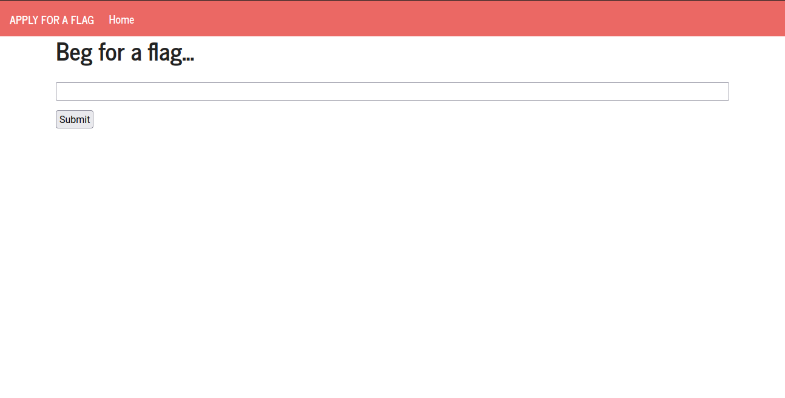
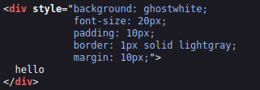
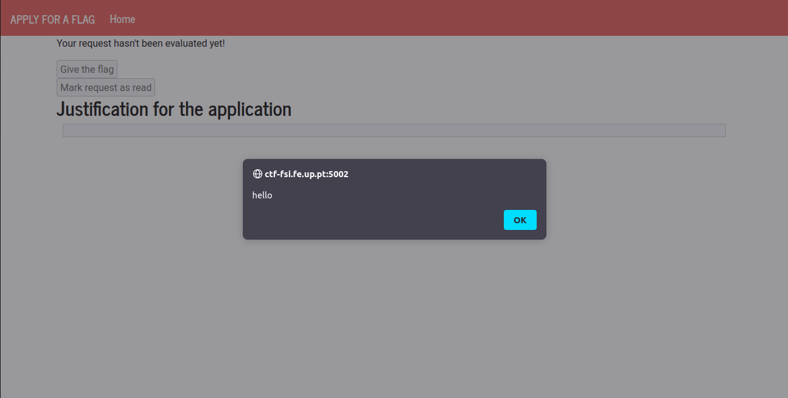
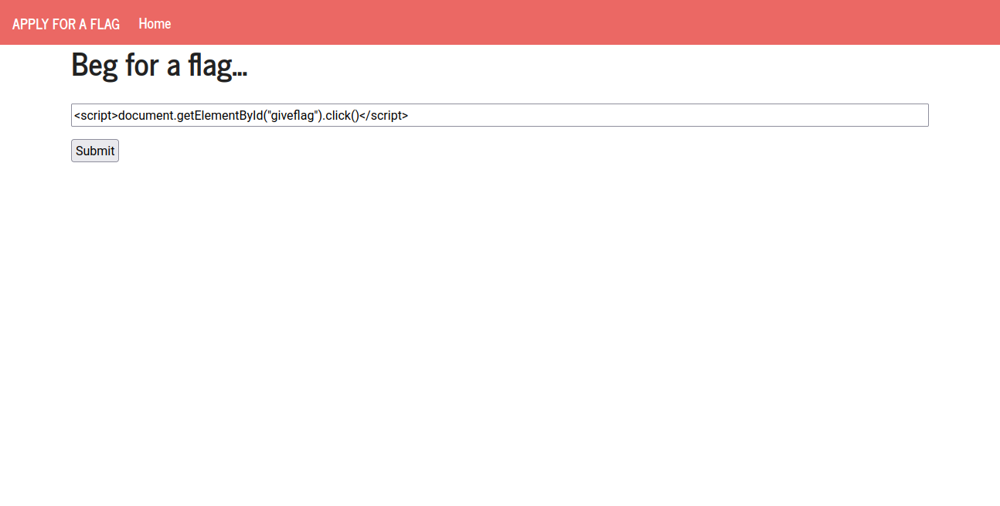
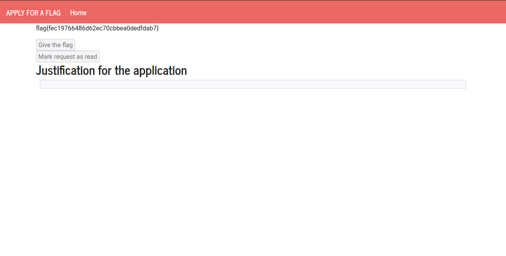
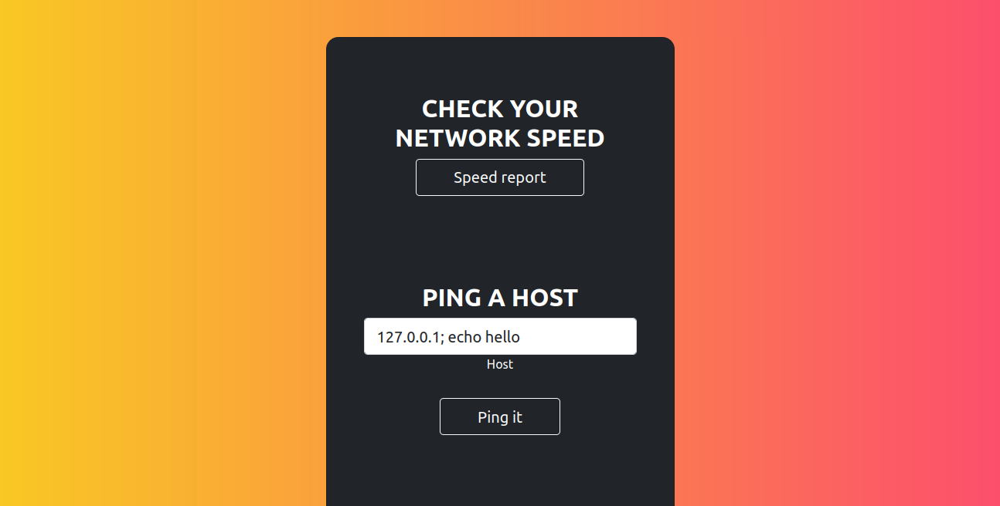
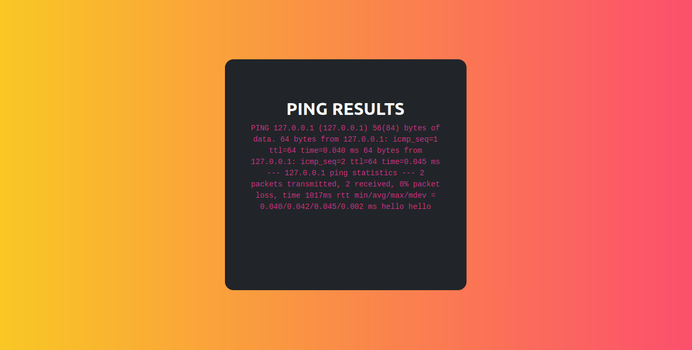
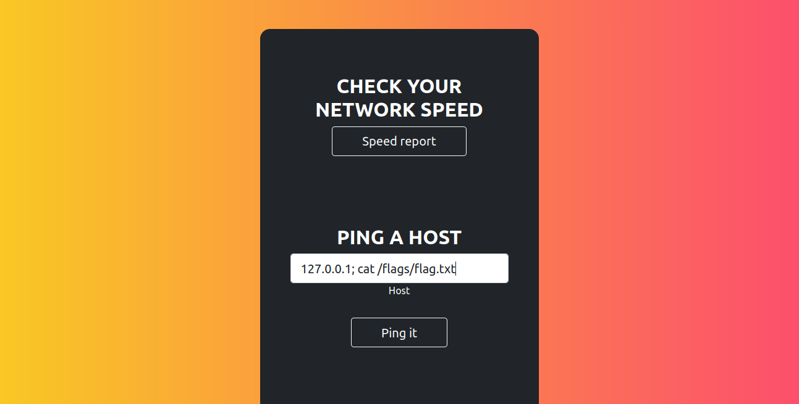
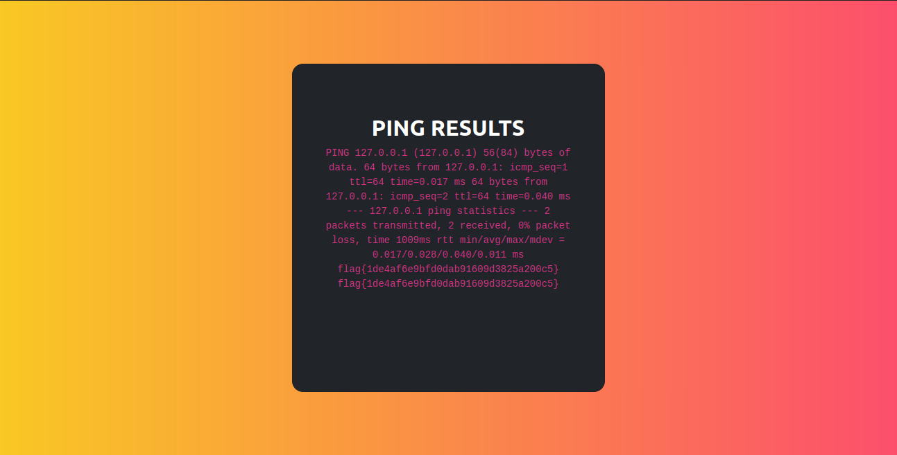

# Cross-Site Scripting (XSS) Attack Lab

## Task 1: Posting a Malicious Message to Display an Alert Window

After logging in as Alice, we enter the XSS payload to the brief description
field of the profile:


After saving and going back to the profile page, we get an alert:


This is an instance of Stored XSS, since the payload is stored in the user
profile and will be loaded everytime the profile page is visited.

## Task 2: Posting a Malicious Message to Display Cookies

For this task, we just replace the previous payload with the new one:

```html
<script>alert(document.cookie);</script>
```

And in the content of the alert we see that our cookies are being displayed:


## Task 3: Stealing Cookies from the Victim’s Machine

In this task, we are asked to, once again, get the victim's cookies, but this
time we need to send them to an attacker controlled machine. Firstly, we will
start a netcat server that will receive the leaked cookies:

```sh
$ nc -lknv 5555
Listening on 0.0.0.0 5555
```

Then, we store the given payload in the Brief Description field:


After saving we get no alert this time, but when we check our netcat server
logs, we see that we received a request that contains the cookies!


Now, everytime an user opens our profile page, we will receive a request
containing their cookies.

## Task 4: Becoming the Victim’s Friend

Using the HTTP Header Live add-on, we send a friend request to samy and analyze
the sent request:


We see that it sends a GET request to /action/friends/add, with the parameters
friend=59 (probably the id corresponding to sammy) and \__elgg_ts and
\__elg_token, which look like some extra parameters used for security reasons.
Now, we will log into Samy's account and build and store the payload:


In this JavaScript code, we are building the HTTP GET request we previously
analyzed, and sending it to the server using AJAX. Now, hopefully, we someone
visits Samy's profile page, they will add him as a friend.


And sure enough, when we log back in as Alice and visit Samy's profile, we send
a request to befriend him. And after refreshing the page, we seed that the *Add
friend* button became *Remove friend*.


### Question 1: Explain the purpose of Lines ➀ and ➁, why are they needed?

This lines are used to get the security tokens needed to send this request.

### Question 2: If the Elgg application only provide the Editor mode for the "About Me" field, i.e., you cannot switch to the Text mode, can you still launch a successful attack?

We don't think it is possible (at least not in modern browsers). We tought
about putting the payload url inside an img element (since the Editor Mode
allows us to add images), but we wouldn't have a way to find values for the ts
and token fields (they seem to change everytime we load the page). We also
found an interesting [answer](https://security.stackexchange.com/questions/135513/what-could-an-img-src-xss-do#answer-135636)
talking about a possibility to perform the attack using SVGs, but we decided
that diving any deeper into this possibility would be a bit out of the scope of
this lab.

## CTF 1

When we open the web page, we are presented with a form with a text field and
a submit button.



After we enter a message in the text field, submit and wait a few seconds, we
get a message saying that our request was not approved.


Analyzing the page source, we see our inputed *hello* inside a div element.
Maybe we can change our input to create a script tag and inject malicious code?



Indeed, if we try use script tags to try and send an alert, we get the alert
sent back to us, thus confirming this web page is vulnerable to XSS.



Now, since we know that the administrator also sees the same page we see, he
will also execute the arbitrary code we provide! Since our objective is to get
him to press the *Give the flag* button, we can use JavaScript code to make him
click it.





## CTF 2

After exploring the web page, the ping functionality was the one that we found
more interesting. After we tried to ping 172.0.0.1, we got the following
output:


Hmmm, this looks very familiar! Indeed, it is the output we get when we use the
ping command in unix systems. We are guessing that the ping command itself is
not vulnerable, since it is a simple widely used program, probably audited by
very smart people. But maybe, the website developers are appending our unparsed
input to ping, and then sending it to the shell. If this is the case, we can
supply a ';' in our payload, followed by an arbitrary command we want to
execute. Let's try it with an echo command.





We can see that we got "hello" printed back to us (twice for some reason). Now
we just need to replace the echo command with a cat to get the flag! (If this
was a more realistic attack we would try to get a reverse shell and then explore
the system even more.)




