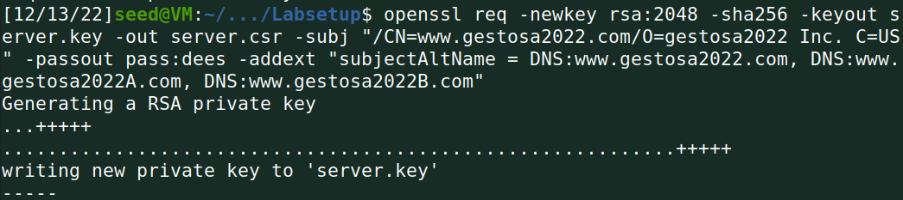

# Public-Key Infrastructure (PKI) Lab

## Task 1: Becoming a Certificate Authority (CA)

After copying the openssl config file to our working directory, we uncommented
the unique_subject line.


Then, we created the index and serial files.


Generating the self-signed certificate:


After running the given commands, we identified the following:

* What part of the certificate indicates this is a CA’s certificate?
<br>&emsp;CA:TRUE
* What part of the certificate indicates this is a self-signed certificate?
<br>&emsp;Issuer: CN = www.modelCA.com, O = Model CA LTD., C = US
<br>&emsp;Subject: CN = www.modelCA.com, O = Model CA LTD., C = US
* In the RSA algorithm, we have a public exponent e, a private exponent d, a
modulus n, and two secret numbers p and q, such that n = pq. Please identify the
values for these elements in your certificate and key files.
<br>&emsp;publicExponent: 65537 (0x10001)
<br>&emsp;privateExponent:
```hex
    29:6b:bb:3d:32:af:fc:76:4f:80:57:a8:e8:a3:77:
    ab:f5:34:0e:10:30:7b:2d:89:9d:66:6c:58:de:cf:
    59:14:28:1f:b2:e4:25:46:b4:e8:58:3f:4d:80:6a:
    7a:12:9c:a2:c1:86:2c:43:8a:58:eb:a9:d3:56:19:
    13:25:84:9f:90:68:b0:a6:8d:77:f7:38:f3:21:20:
    df:cf:12:79:55:18:3b:a5:6d:1b:0a:b4:d2:ac:6e:
    7a:af:1e:45:c2:6c:48:e2:74:dd:d7:e9:c4:1e:7d:
    83:f8:71:29:6c:52:06:9f:41:a8:c1:7a:c9:f6:d2:
    4a:e9:40:6a:a8:a2:5a:fe:59:3f:57:f4:a2:ba:e0:
    65:1b:89:10:db:1a:c4:db:a8:06:03:6b:24:51:d2:
    7c:e7:29:e4:ea:4e:73:bf:77:eb:f8:75:40:9a:37:
    13:4a:e9:f5:20:83:41:dd:77:c7:77:6d:6c:c1:0e:
    35:fd:6a:bb:aa:1f:76:f3:61:93:c3:eb:7f:af:42:
    68:a5:ff:67:79:de:1a:94:2a:0c:09:45:38:0a:c9:
    9a:dd:99:8a:5a:9a:eb:5d:4d:e4:03:60:47:9c:07:
    24:1d:86:b2:b7:17:a2:f2:f3:86:82:03:9c:fd:8b:
    b7:c3:b0:06:25:59:4c:f9:af:1c:12:d6:c9:34:23:
    ee:e2:db:4f:b7:f1:d3:9e:53:38:9b:f5:d4:cb:61:
    44:c0:4b:f1:aa:65:86:56:fc:3f:b4:fd:bb:1b:bf:
    1e:83:66:62:93:10:71:80:10:57:d4:a8:db:bd:d3:
    99:8e:12:cc:a7:6e:6b:f2:1c:8e:f6:23:7a:69:2f:
    ce:6c:fa:c0:63:5f:21:5c:c9:62:85:df:2f:3c:5d:
    4d:ec:d3:66:2a:d1:55:5b:84:21:ee:61:ea:c0:fb:
    bd:38:2b:e2:d0:e7:3d:3f:1a:69:df:c8:8e:84:70:
    38:57:eb:82:77:62:ce:3f:0f:e6:06:63:fb:25:75:
    bd:30:24:0f:c8:9f:9b:d5:c9:5a:e7:08:02:4f:7c:
    5f:61:86:5e:5d:f2:06:76:4c:60:ed:c0:54:1f:8b:
    b0:a2:31:dc:67:64:6f:c3:2e:fd:3a:f9:a5:ea:c0:
    06:23:89:e7:d4:a1:95:f4:27:e2:f7:a7:48:a8:8e:
    f0:fe:60:d2:06:7d:50:f0:cb:ca:e0:28:d8:d9:97:
    56:9f:07:08:05:0d:b7:f7:04:13:1e:0b:12:dd:9c:
    68:00:e8:e8:19:05:9f:74:d6:59:f6:87:81:15:84:
    c7:bf:77:6a:82:b8:da:84:a3:78:09:30:c6:4c:d9:
    0d:31:c8:de:de:91:ce:da:71:3b:09:62:1f:21:6d:
    9b:91
```
<br>&emsp;modulus:
```hex
    00:dd:d5:cc:03:0d:84:ad:c4:e0:fd:33:37:c2:2a:
    f9:fb:e0:49:09:b0:ee:e5:1e:34:51:ec:94:af:8b:
    5a:8f:a0:a1:15:0b:c6:58:f8:68:ea:69:e3:f6:34:
    17:3b:4a:22:8c:00:45:3d:c5:6f:b3:cf:1a:b1:b1:
    b9:b1:44:d7:eb:2f:63:b4:ec:30:ec:13:d9:f9:79:
    7b:c3:29:bd:db:e1:fd:cc:47:3a:5b:2a:87:21:9a:
    64:db:c7:5e:43:80:c3:b6:eb:a3:b4:df:00:30:5f:
    6e:1c:c9:06:4b:4d:3f:22:c6:74:5b:b2:2a:df:eb:
    d6:9d:44:aa:b4:e5:ce:e9:dc:3b:48:02:ed:aa:d8:
    41:1a:6b:b3:5b:51:ef:b9:2c:59:27:a1:cc:bd:79:
    1f:aa:d9:00:25:e9:59:e5:23:08:cb:af:c6:9e:05:
    0e:51:ec:51:c1:c0:5e:71:06:9f:ce:c7:78:b1:34:
    2c:94:f1:99:e3:f1:6b:dd:aa:b2:d9:79:b8:11:76:
    99:2c:ec:90:f7:38:1e:b8:5a:a3:a4:45:90:9b:4f:
    b8:27:25:59:d9:e2:f2:96:ec:37:01:78:51:66:69:
    1e:5b:af:a4:4a:83:62:ce:89:3f:05:68:9f:cf:27:
    9d:de:b9:79:45:4b:9d:63:9f:19:7f:21:78:25:37:
    25:ff:b4:e5:23:34:cd:0e:e8:b8:09:ce:32:52:6c:
    08:1a:fb:bb:0d:5f:78:d8:ef:f8:ec:3a:40:13:b4:
    85:d2:8f:35:2c:31:c0:09:fd:f6:c7:76:fa:7e:97:
    aa:bd:fd:85:24:84:5f:0b:41:c0:15:88:91:42:14:
    1f:d3:93:4f:85:8c:24:84:0a:fa:02:2e:91:49:47:
    33:3f:dd:22:8f:2d:02:7b:38:dc:be:42:87:d3:ed:
    d2:41:86:35:14:1b:ff:b7:6f:89:f7:06:20:27:d7:
    b2:c0:6a:5c:70:f5:4c:1d:6b:5a:e7:29:c5:b0:af:
    ae:f6:b7:4a:20:62:97:0f:91:f9:01:fe:4a:a7:18:
    81:ea:02:66:cb:67:de:6f:a1:2f:39:28:47:32:ae:
    80:fa:d3:53:6f:85:86:3a:1d:42:05:43:8f:77:29:
    e2:23:01:08:a3:30:45:7f:8c:0f:0a:cf:ff:4b:3f:
    a4:31:ac:4f:3d:8d:70:1c:4c:1b:1d:c5:ce:62:3a:
    eb:e0:b5:0c:78:56:25:39:49:99:b7:de:91:67:0c:
    f5:ea:73:f2:aa:50:83:f9:33:a5:76:d6:94:50:3c:
    b2:f0:7c:3b:54:81:eb:cd:d9:25:5f:f7:3c:55:16:
    ec:b1:d3:20:99:c6:ac:9f:9f:62:d8:e7:9b:5b:9d:
    3f:50:67
```
<br>&emsp;prime1:
```hex
    00:fe:81:a2:83:ba:23:34:29:ad:ce:20:d1:59:ab:
    56:7b:01:9e:b0:5d:4c:f4:58:d1:0d:a2:1e:df:fc:
    5e:e7:ac:24:56:2e:75:24:8f:0e:e1:f7:42:09:f5:
    da:ca:63:d7:bb:fe:9d:b9:7b:ea:de:ec:30:eb:ca:
    6d:96:16:42:b3:78:c2:01:17:ba:1b:0f:bb:00:50:
    81:de:2e:5a:9c:c9:da:8d:3a:bc:22:a7:a4:ff:fa:
    ec:df:f7:75:bb:76:73:38:b3:a1:ee:8d:b5:3a:8c:
    ff:b9:8e:d5:22:1b:c2:ad:90:a8:a5:9c:5d:3f:40:
    66:ce:9f:cf:3c:ac:13:9e:76:d1:17:38:50:9a:05:
    78:c3:4a:7a:f3:ce:43:ca:b9:e3:5a:53:19:15:9b:
    74:e5:f0:7d:da:c4:a4:73:b0:02:b2:c9:61:c8:42:
    92:40:16:2e:4a:bc:71:0a:bc:7a:66:6a:87:ef:66:
    87:f9:67:1f:98:f0:e3:85:02:5b:e8:bf:c2:e2:4c:
    f9:2b:0d:44:a9:35:47:c7:41:19:51:1e:66:06:60:
    f3:a8:f3:5e:c2:5a:a5:cc:bd:e0:fb:c1:ef:78:21:
    a3:53:2f:74:65:83:76:04:79:65:cb:93:82:8e:27:
    02:8b:a7:41:d7:71:eb:f4:af:fe:4e:91:1f:a7:65:
    d1:7f
```
<br>&emsp;prime2:
```hex
    00:df:23:13:d6:b8:02:c6:ed:66:aa:6e:d5:8a:fc:
    98:49:65:9b:27:34:cd:8e:93:c5:0a:7c:b0:f4:8a:
    3d:c6:2f:78:d6:8c:26:bc:5f:0a:96:cc:1f:db:90:
    75:1f:ea:ff:34:b8:79:11:ae:25:8b:27:a8:fb:6f:
    33:78:b0:d5:43:95:40:e1:18:4a:7a:05:5f:17:27:
    d0:81:ed:a2:f4:5b:04:46:43:b0:dc:1e:55:92:18:
    8e:33:de:33:bb:03:c5:93:ca:e9:13:c1:6d:97:d6:
    d8:ae:e1:af:18:38:3f:c1:d3:17:73:c7:e3:b7:5f:
    e2:30:ba:e3:28:10:81:5f:28:e3:ad:a0:70:fd:54:
    e7:f3:1c:e6:fc:ff:92:b2:04:cd:06:99:94:c1:c1:
    ef:28:79:c1:60:c3:d1:e0:e8:cc:92:42:fa:a8:70:
    74:a0:0f:46:e1:c8:2e:74:a5:f3:04:cd:ae:1f:e7:
    1a:c9:5b:a1:33:a0:79:d0:ef:4c:e6:5f:55:0c:ad:
    35:9a:fd:c7:3e:9c:1d:ad:5b:70:d6:ea:b6:08:95:
    a4:3c:42:c8:8e:05:55:46:70:c8:b1:79:49:81:0f:
    a1:f7:2b:56:ff:52:29:a6:50:1f:a5:4b:11:a3:2a:
    84:db:46:08:98:95:b2:17:b0:e0:9c:27:5d:81:39:
    a5:19
```

## Task 2: Generating a Certificate Request for Your Web Server

Generating a CSR for www.gestosa2022.com:


Regenerating the CSR but with the alternative names:



## Task 3: Generating a Certificate for your server

After creating the necessary directories, we ran the command to turning the CSR
into a X509 certificate:


Uncommenting copy_entensions in the config file:


And signing the the certificate once again:


Finally, we check whether the alternative names are included:

```sh
$ openssl x509 -in server.crt -text -noout
(...)
X509v3 Subject Alternative Name: 
    DNS:www.gestosa2022.com, DNS:www.gestosa2022A.com, DNS:www.gestosa2022B.com
(...)
```

## Task 4: Deploying Certificate in an Apache-Based HTTPS Website

First, we make a copy of bank32_apache_ssl.conf with the name
gestosa2022_apache_ssl.conf and make the necessary adjustments.


We also make a copy of the example DocumentRoot directory:


Copying the certificate and key files to the container and changing their
names:


Enabling apache ssl module and the site:


Starting the web server:


Hmmm, it looks like our browser is trying to prevent us from accessing the web
page. After clicking on *Advanced...* we conclude it is because the CA that
issued the website's certificate is not trusted by the browser.


To fix this, we load our CA certificate that we created in Task 1 into the
browser so it can be trusted.


Finally, we are able to browse the web site using HTTPS!


## Task 5: Launching a Man-In-The-Middle Attack

For this task, we will try to impersonate a very important website,
*sigarra.up.pt*. We will reuse everything we created in the previous task, and
just change the ServerName to be sigarra.up.pt.


Then, we restart the apache server:


After that, we simulate a DNS cache poisoning attack by adding an entry to
/etc/hosts:


Now, when we try to access sigarra, our browser tries to prevent us from
accessing the site. This is happening because the website certificate was
issued for www.gestosa2022.com, but the hostname is sigarra.up.pt. Since this
don't match, the web browser will not allow us to continue.


To prevent this warning from popping up, we would need to have a certificate
issued to sigarra.up.pt, which in the real world would implicate that we either
somehow compromised a trusted CA and issued a certificate; or that we stole the
private key for the sigarra certificate. Both of this options are very hard to
pull off in the real world (unless we are part of a certain alphabet agency
backed up by a powerfull government), and thus the power of PKI.

## Task 6: Launching a Man-In-The-Middle Attack with a Compromised CA

As we mencioned at the end of the previous task, performing a MITM attack would
be possible if we somehow compromised a trusted CA. We will use the CA created
in Task 1 (which we already controll and is trusted by the victim's browser) to
emulate this. Basically we will just repeat the Tasks 2-4, but replacing the
website name with the target. We will start by creating a CSR:


Then we will use our "compromised" CA to sign the certificate:


After that, we copy the generated certificate and key to the Docker container:


Finally, we make the necessary adjustments to the apache ssl config file from
the previous task:


After we did all of this, we still couldn't access the site. After some
debugging we figured out it was because our certificated also needed
alternative names. So after reduing our previous steps this time with
sigarra.up.pt as an alternative name, we successfully accessed sigarra, but
instead of the normal sigarra page, we visited our Hello World page!


If this was a realistic attack, we would take the take to make our page as
similar as possible to sigarra's, and edit the login form to make it send the
victim's credentials to our server when he tries to login.

## CTF 1

Since we are told that p is very close to 2^512 and q to 2^513, we will use
Wolframalpha which lets us get the prime number that comes after a number of
our liking. We obtain the values:

```text
p = 13407807929942597099574024998205846127479365820592393377723561443721764030073546976801874298166903427690031858186486050853753882811946569946433649006084171
q = 26815615859885194199148049996411692254958731641184786755447122887443528060147093953603748596333806855380063716372972101707507765623893139892867298012168351
```

After that, we use an online RSA calculator that, using the values for p and
q we just obtained and the value for e that we were given, obtains d:

```text
d = 32148745104617719611469860837520069095243013547461161624365705436392549353428328854051450263424947795515997965956157657970803482741943111508623685194329747704158900209679524603520884720244523165529357010257764632981617985618265704337977264403534764689557688026111797495540714181081554773530395510587656455823
```

Finally, we just put this values in the given script, and obtain the flag!


