# Trabalho realizado na Semana #4

## Task 1: Manipulating Environment Variables

Using printev to print out environment variables:

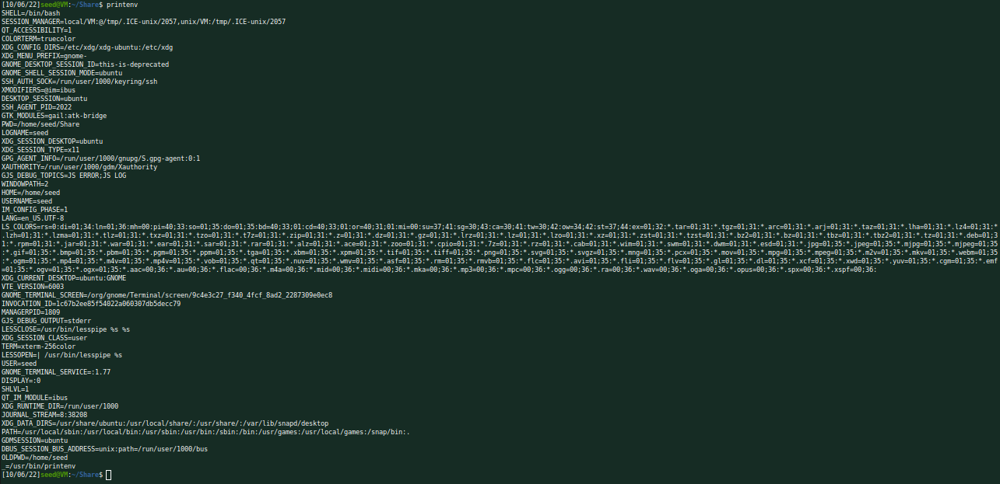

Using printenv to print out PWD environment variable:

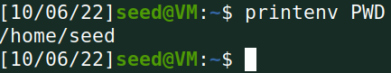

Using export on PWD environment variable (notice that the blue text changed):

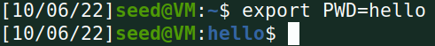

And using unset to get it back to normal:

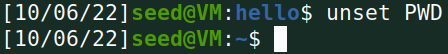

## Task 2: Passing Environment Variables from Parent Process to Child Process

### Task 2 - Step 1

After compiling and running myprintenv.c, we get the following output:

By analizing this, we observe that the child process has some environment
variables set.

### Task 2 - Step 2

After moving the printenv() funciton to the parent part of the code, compiling
again and running gives us the following output:

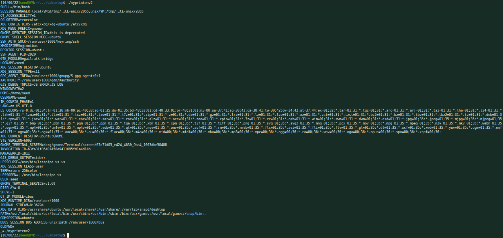

### Task 2 - Step 3

We seem to get an output very similar to the previous. By using the diff
command to compare them we get (almost) no output, which comfirms that the
outputs are indeed (almost) the same:

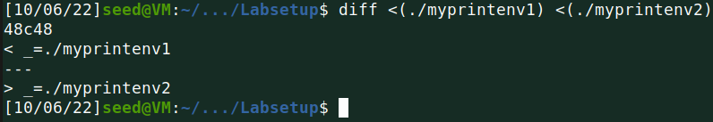

Our conclusion is, that after using a fork(), the environment variables of the
child process become the same of its parent.

## Task 3: Environment Variables and execve()

### Task 3 - Step 1

After compiling and running the program, we seem to get no output:

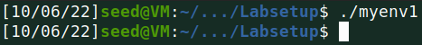

From this we conclude that the new loaded program probably does not automatically
inherit the environment variables of the calling process.

### Task 3 - Step 2

But after replacing NULL with environ, we observe that this time the new
program has some environment variables set:

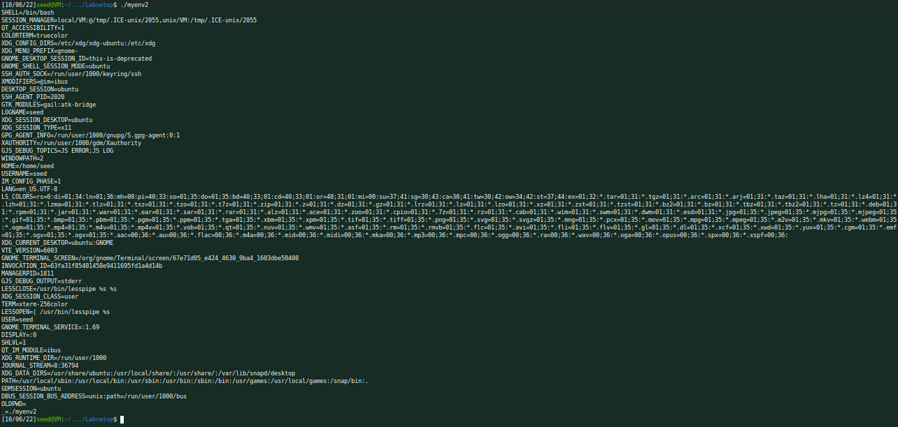

### Task 3 - Step 3

From analizing the previous results, we suspect that the new program loaded by
execve() gets its environment variables from the third parameter of execve().

By checking the manual pages for execve, we confirm our suspicion ( *envp* is the
third argument of execve()):

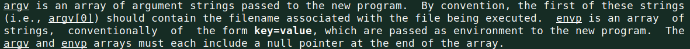

## Task 4: Environment Variables and system()

As expected, we verify that the new program loaded by the calling process
seems to keep all the environment variables:

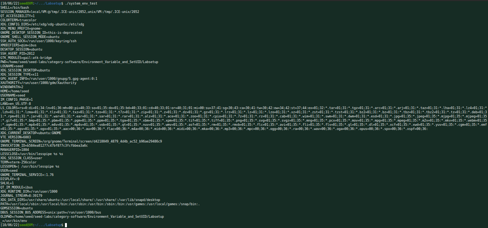

## Task 5: Environment Variable and Set-UID Programs

As we have already seen in task 2, the parent’s environment variables are
inherited by the child process, after calling fork(). So since, the shell
calls fork() to create a child process, and uses the child process to run
the program, we are expecting that the program will print out all the
environment variables, including those with the modified values.

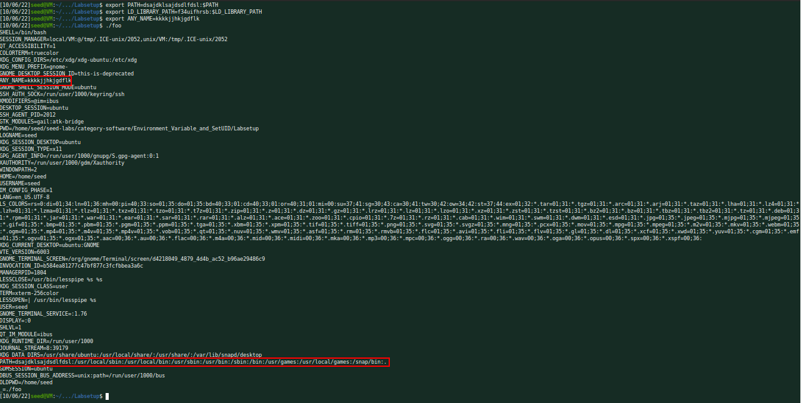

But if we look carefuly, we can't seem to find the LD_LIBRARY_PATH environment
variable! Wonder why that is the case...

After scavenging through the manual pages, we came to the conclusion that our
binary is executed in "secure-execution mode". We can see the reason on why
that is the case in the manual pages for ld.so:

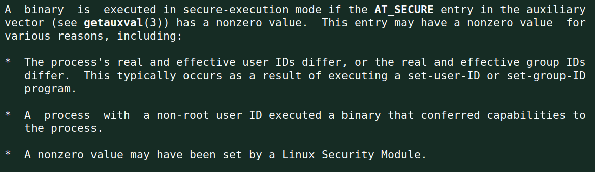

Here we can cleary see that, as a result of executing a set-user-ID program,
the process's real and effective user IDs differ, causing *AT_SECURE* to have
a non-zero value, which causes the program to execute in secure-execution mode.

But what does secure-execution mode have to do with LD_LIBRARY_PATH? Well,
after exploring the same manual page some more, we found the following:

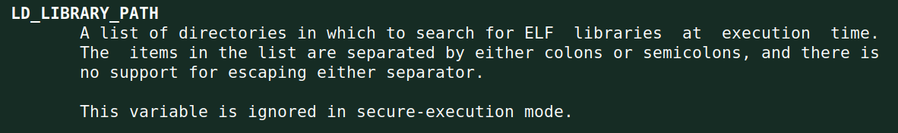

Ah! So, since LD_LIBRARY_PATH is ignored during secure-execution mode, and our
program is executed in this mode due to making a system call to set-user-ID,
now it finally becomes clear why we couldn't seem to find the LD_LIBRARY_PATH
variable in the first screenshot of this section.

## Task 6: The PATH Environment Variable and Set-UID Programs

We start by adding /home/seed to the start of our path and by creating in that
same directory a file named ls what executes the shell command whoami:

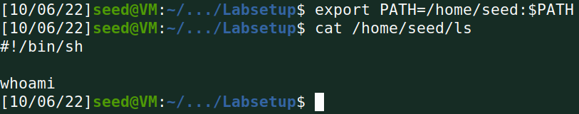

Then, after creating, compiling the program under the name "myls", changing
its owner to root, and making it a Set-UID program, we run it and get the
following:

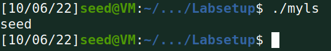

Well, we seem to be calling our ls script instead of the real one, but the
whoami command is returning seed instead of root.

After reading the note, we realize why that is the case, and after
circunventing this, we finally see that we successfully executed our
"malicious" script as root:

To make our script more malicious, we could instead spawn a root shell, which
in turn allows us do anything we please to the system.

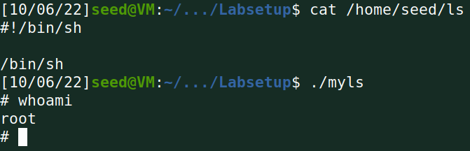

## Task 7: The LD_PRELOAD Environment Variable and Set-UID Programs

Making myprog a regular program and running it as a normal user:

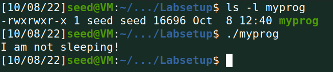

Making myprog a SET-UID root program and running it as a normal user (it slept
for 1 second):

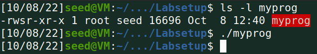

Making myprog a Set-UID root program, exporting the LD_PRELOAD environment
variable again in the root account and running it:

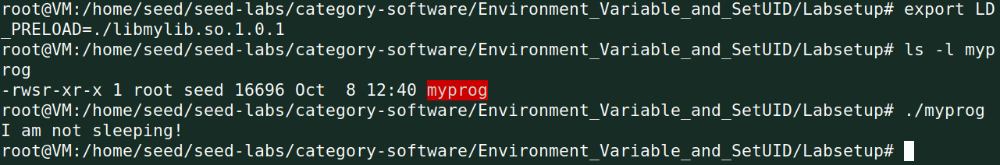

Making myprog a Set-UID user1 program exporting the LD_PRELOAD environment
variable again in a different user’s account and running it (it slept for
1 second):

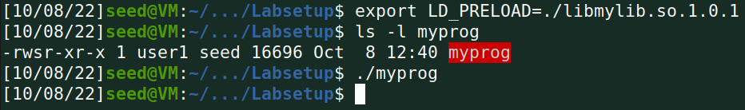

As we could see, our "malicious" library only was loaded when the effective
user ID of the process was the same as the real user ID. From our previous
conclusions of **Task 5**, we were already expecting this behaviour, since
LD_PRELOAD (just like LD_LIBRARY_PATH and all other LD_* variables), is ignored
during secure-execution mode, and as we have already seen, this mode is active
when an user executes a set-uid program of another user.

## Task 8: Invoking External Programs Using system() versus execve()

### Task 8 - Step 1

There is a very obvious flaw in this program: it is appending user controlled
input to the command that is to be called by system without parsing any special
characters. This means that we cat just cat a random file, then use the *;*
special shell operator to let us follow the cat command by any command of our
liking. And since the program executes as root, this command will have root
privileges aswell:

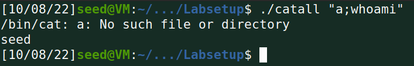

As you can see it works as we were expecting, however we need to do the same
thing we did in **Task 6** to prevent the shell from dropping privileges:

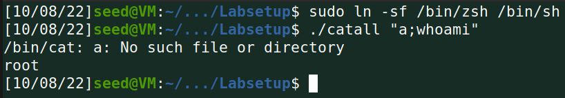

And sure enough, we can execute shell commands as root! As we have previously
seen we could spawn a root shell and completely take over the system.

### Task 8 - Step 2

However, when we call execve() instead of system(), we not at all expect our
attack to work, since there is no call to the shell, we can't abuse our little
*;* trick like before:

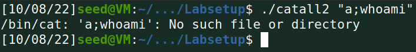

And as expected, this didn't work since our argument was just directly passed
as an argument to /bin/cat, instead of executing 2 commands like before.

## Task 9: Capability Leaking

The mistake that we immediatly spot here was that the file was opened with root
privileges, but it was never closed. So after the process calls (for some
reason) /bin/sh we could technically still access the open file as if we were
root (even though our privilege just dropped).
To test our theory, we wrote the following C program:

It probably doesn't need much explanation, it just prints some text to a given
file descriptor.
Now lets test it!

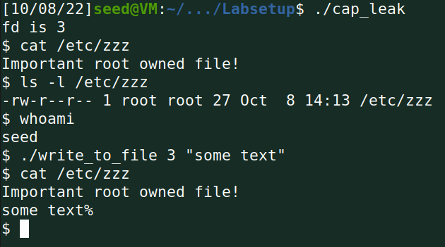

As you can see, even though we had no permission to write to this file, we are
still able to do so thanks to capability leaking.

## CTF

## Recognition

### Plugins and versions

* WordPress version 5.8.1
* WooCommerce plugin version 5.7.1
* Booster for WooCommerce plugin version 5.4.3

### Users

* admin (ID 1, found @ [users json](http://ctf-fsi.fe.up.pt:5001/wp-json/wp/v2/users/))
* Orval Sanford (no more information found)

## Vulnerability search

We found lots of vulnerabilities affecting the versions of WordPress and its
plugins reported in the previous section.

## Vulnerability chosen

We went with a Vulnerability in the plugin *Booster for WooCommerce*,
[CVE-2021-34646](https://www.cvedetails.com/cve/CVE-2021-34646/).
This version of the plugin is vulnerable to authentication bypass, which allows
attackers to impersonate users, which is exactly what we are looking for!

## Finding an exploit

We found in [exploit-db](https://www.exploit-db.c/exploits/50299om) a python
script tha tgenerates links that allow us to access the system as any user.

## Exploiting the system

After running the exploit, giving it the target and ID of the user that we want
to impersonate (we found this ID in the recognition fase), it generates a
[link](http://ctf-fsi.fe.up.pt:5001/my-account/?wcj_verify_email=eyJpZCI6IjEiLCJjb2RlIjoiMzdlMWU5MTA1ZDA2ZDZkOTUxZTIzNjcwZTNmNjQyMzEifQ),
and when we open that link, we find ourselves logged in as admin!
